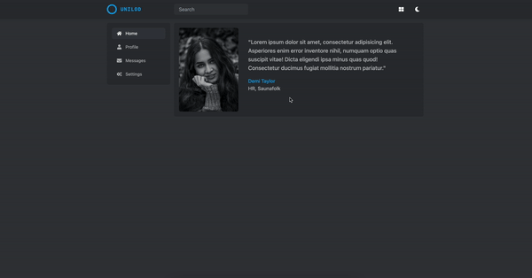

# Portfolio-Vue

<!-- <p align="center">

</p> -->

## Features
* [x] Three responsive layouts
* [x] Theme switcher
* [x] Layout switcher
* [x] Template based on tailwindcss
* [x] Reusable layouts components

<!-- ## Live demo -->

## Usage

### 1. Install [Node.js](https://nodejs.org/en/)

### 2. Install dependencies
```
npm install
```
### 3. Serve with hot reload
```
npm run serve
```
### 4. Build for production
```
npm run build
```
